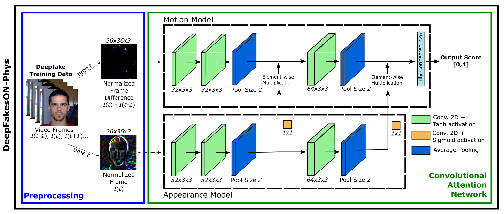

# DeepFakesON-Phys: DeepFakes Detection based on Heart Rate Estimation



## Overview
DeepFakesON-Phys is DeepFake detection framework based on physiological measurement. In particular, it considers
information related to the heart rate using remote photoplethysmography (rPPG). 
DeepFakesON-Phys uses a Convolutional Attention Network (CAN), which extracts spatial and temporal information from video frames, analyzing and combining both sources to better detect fake videos. 

DeepFakesONPhys has been experimentally evaluated using the latest public databases in the field: Celeb-DF and DFDC. The results
achieved, above 98% AUC (Area Under the Curve) on both databases, outperform the state of the art and prove the success of fake detectors based on physiological measurement to detect the latest DeepFake videos.

For further detail you can consult [our paper](https://arxiv.org/pdf/2010.00400.pdf).


## Access

-- Configuring environment in Windows:

1) Installing Conda: https://conda.io/projects/conda/en/latest/user-guide/install/windows.html

  Update Conda in the default environment:

    conda update conda
    conda upgrade --all

  Create a new environment:

    conda create -n [env-name]

  Activate the environment:

    conda activate [env-name]

2) Installing dependencies in your environment:

  Install Tensorflow and all its dependencies: 
    
    pip install tensorflow
    
  Install OpenCV:

    conda install -c conda-forge opencv
  
3) If you want to use a CUDA compatible GPU for faster predictions you will need CUDA and the Nvidia drivers installed in your computer: https://docs.nvidia.com/deeplearning/sdk/cudnn-install/
 
   
-- Using DeepFakesON-Phys for predicting scores: (under work)

  1) Download or clone the repository. 
  
  2) You have to run the DeepFakesON-Phys_extract_preditions.py script. 
        
        First, it preprocesses the video sequences to obtain the raw normalized frames and the difference frames to feed DeepFakesON-Phys. 
        
        Then it makes inference with the processed input and returns a fake/genuine score for each frame in the video and saves them in the scores.txt file. You can combine the individual scores as you wish, e.g., by temporal windows, using some kind of temporal integration, etc.
  


## Citation
If you use DeepFakesON-Phys please cite:

```
@article{hernandez2020deepfakeson,
  title={DeepFakesON-Phys: DeepFakes Detection based on Heart Rate Estimation},
  author={Hernandez-Ortega, Javier and Tolosana, Ruben and Fierrez, Julian and Morales, Aythami},
  journal={arXiv preprint arXiv:2010.00400},
  year={2020}
}

```
## Contact
If you have any questions, please contact us at [javier.hernandezo@uam.es](javier.hernandezo@uam.es), or [ruben.tolosana@uam.es](ruben.tolosana@uam.es)

## Changelog
06.11.2020: Initial release of DeepFakesON-Phys

